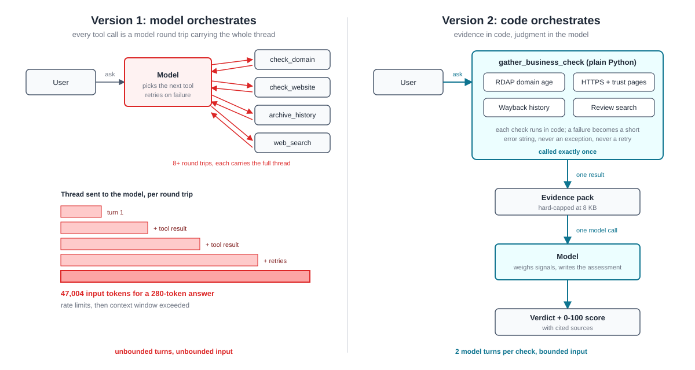

# Legit Check Agent — Azure Functions Hosted Skills

A business-legitimacy chat agent built on [Azure Functions hosted skills](https://learn.microsoft.com/en-us/azure/azure-functions/functions-hosted-skills) (previewed at Build 2026 as the serverless agents runtime). Give it the name or URL of an online business and it assesses how trustworthy it looks: verifiable technical signals gathered in code, one LLM call for the judgment.

Companion sample to the blog post on sjwiggers.com about why this design gathers evidence deterministically instead of letting the model orchestrate tools.

## What it does

> **You:** Is thenewsound.nl legit?
>
> **Agent:** **Verdict: Looks legitimate. Trust score: 78/100.** The domain was registered in March 2024, the site links contact, terms, privacy, and returns pages, and search results show a 4.6/5 Trustpilot rating from 31 reviews. The shop's own claim of 4.8 from 890 reviews is self-published and not treated as independent verification. Use a payment method with buyer protection for a first purchase. …

## Design: evidence in code, judgment in the model

The model does not orchestrate tools. One agent-facing tool, `gather_business_check`, runs every check deterministically in Python and returns a single evidence pack, hard-capped at 8 KB. The model calls it exactly once and writes the verdict. Two model turns per check, bounded input, no retry loops.



The first version of this sample let the model orchestrate four separate tools. It rate-limited itself, grew one turn to 47,004 input tokens, and finally exceeded the model's context window. The diagram above shows both versions; the blog post tells the full story. A failed signal check becomes a short error string inside the evidence (the `_safe` wrapper), never an exception and never a retry.

## Signals

| Signal | Source | Key needed |
|---|---|---|
| Domain registration, age, registrar | RDAP (rdap.org) | No |
| Reachability, redirects, trust pages (contact, terms, privacy, returns) | Direct HTTPS fetch | No |
| First and latest snapshot | Internet Archive Wayback CDX | No |
| Trustpilot rating, reviews, scam reports | Tavily search API | `TAVILY_API_KEY` (optional) |

Review content is reached through web search grounding rather than scraping or per-provider APIs, so no Trustpilot or Google Places accounts are required. Without a Tavily key the agent still works and says clearly that it judged on technical signals only.

## How it runs

The hosted skill is defined in `src/main.agent.md`. The runtime discovers it at startup, registers the HTTP trigger and built-in chat UI endpoint, and runs it through Microsoft Agent Framework. The tool in `src/tools/legit_tools.py` is a plain Python function decorated with `@tool`.

```
src/
  main.agent.md          # the hosted skill: instructions, verdict format, ground rules
  tools/legit_tools.py   # gather_business_check + signal helpers
  agents.config.yaml     # runtime defaults (model, timeout)
  function_app.py        # standard entry point
infra/                   # Bicep: Foundry account + model, Flex Consumption app, RBAC
azure.yaml               # azd wiring
```

## Prerequisites

- [Azure Developer CLI (azd)](https://learn.microsoft.com/azure/developer/azure-developer-cli/install-azd)
- An Azure subscription with permissions to create Microsoft Foundry resources and model deployments
- Optional: a [Tavily](https://tavily.com) API key for the review/search grounding tool (free tier is sufficient)

## Quick start

```bash
git clone https://github.com/steefjan1/legit-check-agent
cd legit-check-agent
azd env new legit-check-dev
azd env set TAVILY_API_KEY <your-key>   # optional but recommended
azd up
```

When prompted:
- **Location:** Select **Central US** (`centralus`) — hosted skills require this region during preview
- **Subscription:** Select your Azure subscription

### Choosing a model

The template defaults to `gpt-4.1`, which is marked legacy and sits in a crowded quota pool. Overriding to a current small model is recommended:

```bash
azd env set FOUNDRY_MODEL gpt-5.4-mini
azd env set FOUNDRY_MODEL_NAME gpt-5.4-mini
azd env set FOUNDRY_MODEL_VERSION 2026-03-17
```

The model name and version must match the region's catalog verbatim (`az cognitiveservices model list -l centralus`).

## Access the chat UI

```
https://<function-app-name>.azurewebsites.net/api/agents/main/
```

On first visit, a connection settings dialog appears with the Base URL pre-filled. Get the Function key from the Azure portal (**\<function-app\> → App keys → default**), paste it, and save.

## Environment variables set by deployment

| Setting | Purpose |
|---|---|
| `AZURE_FUNCTIONS_AGENTS_PROVIDER` | `foundry` |
| `FOUNDRY_PROJECT_ENDPOINT` | Microsoft Foundry project endpoint |
| `FOUNDRY_MODEL` | Model deployment name |
| `TAVILY_API_KEY` | Optional web search grounding key |

## Local development

```bash
cd src
cp local.settings.json.example local.settings.json   # fill in endpoint + model
pip install -r requirements.txt
func start
```

## A note on scope

The verdicts are signal-based assessments, not guarantees. Sophisticated scams can fake many signals and legitimate young businesses can look thin; the agent says so in every answer, cites the sources it used, and recommends buyer-protected payment methods when it is unsure. It refuses the reverse use case of making a site look more legitimate than it is.
